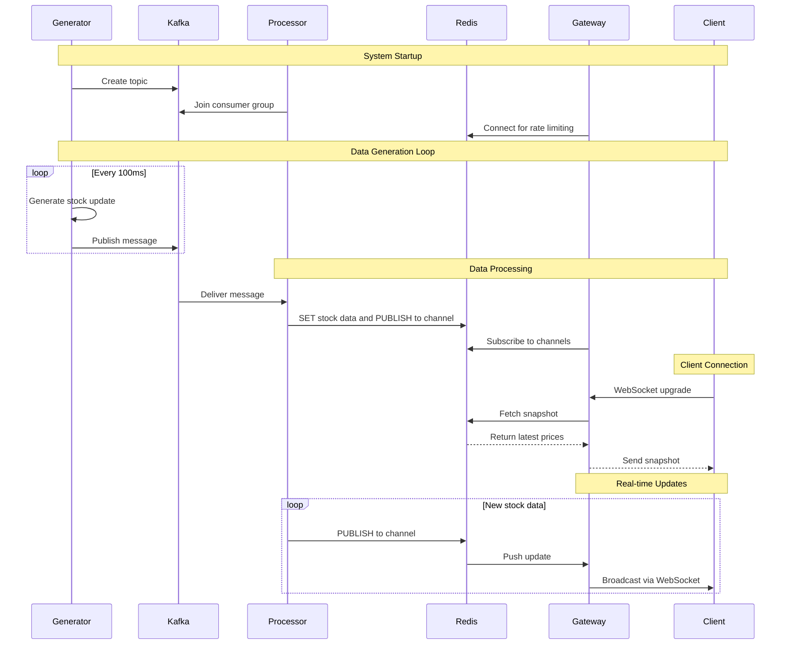

# Stock Watchlist System

## Overview

The Stock Watchlist System is a high-performance, real-time stock market data streaming system built with Go. It features Kafka for messaging, Redis for caching and pub/sub, and WebSocket connections for real-time client updates.

## Features

- **Real-time Stock Data Simulation:** The `generator` component simulates real-time stock market data.
- **Message Queuing:** The system uses Kafka as a message broker to handle the stream of stock data.
- **Data Processing:** The `processor` component consumes stock data from Kafka, processes it, and stores it in Redis.
- **Real-time Updates:** The `gateway` component provides real-time updates to clients via WebSockets.
- **WebSocket API:** The `gateway` exposes a WebSocket API for clients to connect and receive real-time data.
- **Scalability:** The use of Kafka and a distributed architecture allows for horizontal scaling.
- **Configuration:** The system is configurable via environment variables.
- **Graceful Shutdown:** All components handle graceful shutdown, ensuring that no data is lost.

## Architecture

The system is composed of three main components:

- **Generator:** Produces simulated stock market data and sends it to a Kafka topic.
- **Processor:** Consumes data from the Kafka topic, processes it, and stores it in Redis.
- **Gateway:** Serves WebSocket connections, subscribes to Redis pub/sub channels, and pushes real-time updates to clients.



## Getting Started

### Prerequisites

- Go 1.25.5
- Docker and Docker Compose
- Make

### Quick Start

1. **Start Infrastructure**:
   ```bash
   make up
   ```

2. **Run Components** (in separate terminals):
   ```bash
   make gen    # Start data generator
   make proc   # Start processor
   make gtw    # Start gateway
   ```

3. **Connect Clients**:
   - WebSocket URL: `ws://localhost:8081/ws`
   - To subscribe to symbols, send a JSON message with the following structure:
     ```json
     {
       "action": "subscribe",
       "payload": {
         "symbols": ["AAPL", "GOOG"]
       }
     }
     ```
   - Receive real-time price updates.

### Management UIs
Once the infrastructure is running, you can access the following UIs in your browser:
- **Kafka UI**: http://localhost:8080 - Browse Kafka topics, messages, and consumer groups.
- **Redis Insight**: http://localhost:5540 - Inspect data stored in Redis.


### Development

```bash
# Tidy up Go modules
make deps

# Build all components
go build ./cmd/generator
go build ./cmd/processor
go build ./cmd/gateway


# Clean up
make down
```

## Configuration

Copy `.env.example` to `.env` and modify as needed:

```bash
cp .env.example .env
```

The system is configured using environment variables. See `.env.example` for a list of all available options.
