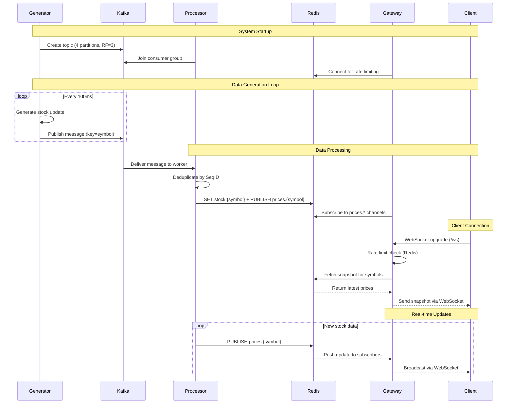

# Stock Watchlist System

A high-performance, real-time stock market data streaming system built with Go, featuring Kafka for messaging, Redis for caching and pub/sub, and WebSocket connections for real-time client updates.

## Overview

The Stock Watchlist System provides real-time stock price updates to connected clients through WebSocket connections. The system consists of three main components:

- **Generator**: Produces simulated stock market data
- **Processor**: Consumes data from Kafka and stores it in Redis
- **Gateway**: Serves WebSocket connections and pushes real-time updates to clients

## Architecture



### Data Flow

1. **Generator** produces stock updates and sends them to Kafka
2. **Processor** consumes from Kafka, stores in Redis, and publishes to Redis channels
3. **Gateway** subscribes to Redis channels and pushes updates to WebSocket clients
4. **Clients** receive real-time updates via WebSocket connections

## Components

### Generator

The Generator component simulates real-time stock market data by producing price updates for configured stock symbols.

#### Functionality

- **Data Generation**: Creates realistic stock price fluctuations using random variations
- **Sequence Tracking**: Maintains sequence IDs for each symbol to ensure ordered processing
- **Kafka Publishing**: Sends JSON-formatted updates to Kafka topics with symbol-based partitioning
- **Batch Optimization**: Uses Kafka batching for efficient network I/O
- **Graceful Shutdown**: Ensures clean closure of Kafka connections

#### Key Features

- Configurable stock symbols and base prices
- 100ms intervals between updates (~10 updates/second)
- Async Kafka writes with error handling
- Topic auto-creation with proper partitioning

#### Configuration

```env
GENERATOR_TICKERS=AAPL,GOOG,TSLA,AMZN
GENERATOR_BASE_PRICES_AAPL=150.0
GENERATOR_BASE_PRICES_GOOG=2800.0
GENERATOR_BASE_PRICES_TSLA=700.0
GENERATOR_BASE_PRICES_AMZN=3400.0
```

#### Usage

```bash
make gen
```

### Processor

The Processor component handles the core data processing pipeline, consuming from Kafka and managing Redis storage.

#### Functionality

- **Kafka Consumption**: Reads messages from Kafka with consumer groups for scalability
- **Worker Pool**: Distributes processing across multiple workers using consistent hashing
- **Deduplication**: Prevents processing of duplicate messages using sequence IDs
- **Redis Storage**: Stores latest stock data with TTL and publishes to channels
- **Pipeline Operations**: Atomic Redis SET and PUBLISH operations
- **Monitoring**: Optional Redis statistics logging (removed in current version)

#### Key Features

- Configurable worker pool size (default: 10 workers)
- Per-symbol worker assignment for ordered processing
- Redis TTL to prevent unbounded growth
- Graceful shutdown with worker draining
- Error handling and retry logic

#### Configuration

```env
PROCESSOR_NUM_WORKERS=10
```

#### Usage

```bash
make proc
```

### Gateway

The Gateway component provides the WebSocket API for real-time client connections and manages subscriptions.

#### Functionality

- **WebSocket Server**: Handles WebSocket upgrade requests and maintains connections
- **Smart Routing**: Efficiently manages symbol subscriptions with reference counting
- **Redis Integration**: Subscribes to Redis pub/sub channels for real-time updates
- **Rate Limiting**: Redis-based token bucket rate limiting (1 req/sec, burst 5)
- **Connection Management**: Enforces connection limits and origin validation
- **Snapshot Delivery**: Sends latest data on subscription
- **Metrics**: Prometheus metrics for active connections

#### Key Features

- Granular subscription management (subscribe/unsubscribe per symbol)
- Automatic Redis channel management
- Connection pooling and timeout handling
- IP-based rate limiting with Redis persistence
- Origin and connection limit validation
- Ping/pong keepalive mechanism

#### Configuration

```env
GATEWAY_VALID_TICKERS=AAPL,GOOG,TSLA,AMZN
GATEWAY_TIMEOUTS_WRITE_WAIT=10s
GATEWAY_TIMEOUTS_PONG_WAIT=60s
GATEWAY_TIMEOUTS_PING_PERIOD=54s
GATEWAY_TIMEOUTS_SEND_BUFFER_SIZE=256
GATEWAY_MAX_CONNECTIONS=1000
GATEWAY_ALLOWED_ORIGINS=*
```

#### API Endpoints

- `GET /ws` - WebSocket endpoint for real-time updates

#### Usage

```bash
make gtw
```

## Configuration

### Environment Variables

Copy `.env.example` to `.env` and modify as needed:

```bash
cp .env.example .env
```

### Required Services

- **Redis**: For caching and pub/sub (default: localhost:6379)
- **Kafka**: For message queuing (default: localhost:9092,9093,9094)

## Getting Started

### Prerequisites

- Go 1.25+
- Docker and Docker Compose
- Make

### Quick Start

1. **Start Infrastructure**:
   ```bash
   make up
   ```

2. **Run Components** (in separate terminals):
   ```bash
   make gen    # Start data generator
   make proc   # Start processor
   make gtw    # Start gateway
   ```

3. **Connect Clients**:
   - WebSocket URL: `ws://localhost:8081/ws`
   - Send JSON array of symbols: `["AAPL", "GOOG"]`
   - Receive real-time price updates

### Development

```bash
# Build all components
go build ./cmd/generator
go build ./cmd/processor
go build ./cmd/gateway

# Clean up
make down
```

## Monitoring

### Observability

- **Logs**: Structured JSON logging with configurable levels
- **Redis Keys**: Rate limiting data in `ratelimit:*` keys

### Health Checks

- Redis connectivity check on startup
- Kafka topic creation and connectivity
- WebSocket ping/pong for connection health

## Performance Characteristics

- **Throughput**: ~10 updates/second per symbol (generator limited)
- **Latency**: Near real-time processing (< 10ms end-to-end)
- **Scalability**: Horizontal scaling with Kafka partitions and Redis clustering
- **Concurrency**: Worker pools and async operations